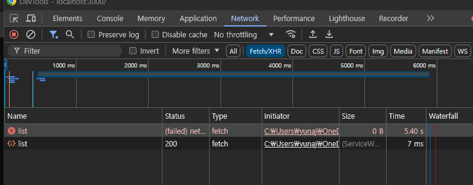

# ISSUE

- next.js 에서 msw로 mocking 데이터를 만들었다. 하지만 처음 fetch할때 error가 나고, 이후에 성공이 된다. cra 환경으로 만든 react에서는 fetch이슈가 없었는데 next.js에서 생긴거 보니 아마도 next.js의 ssr 문젝가 아닐까 생각했다.
  

## 시도1

- server 환경일때와 client환경일때를 따로 구분해서 mocking api를 호출하는 함수를 만들었다. 결과는 <p style="color:#FF5733">실패!</p>

```js
async function initMSW() {
  if (typeof window === "undefined") {
    const { server } = await import("./server");
    server.listen();
  } else {
    const { worker } = await import("./browser");

    worker.start();
  }
}

export { initMSW };
```
