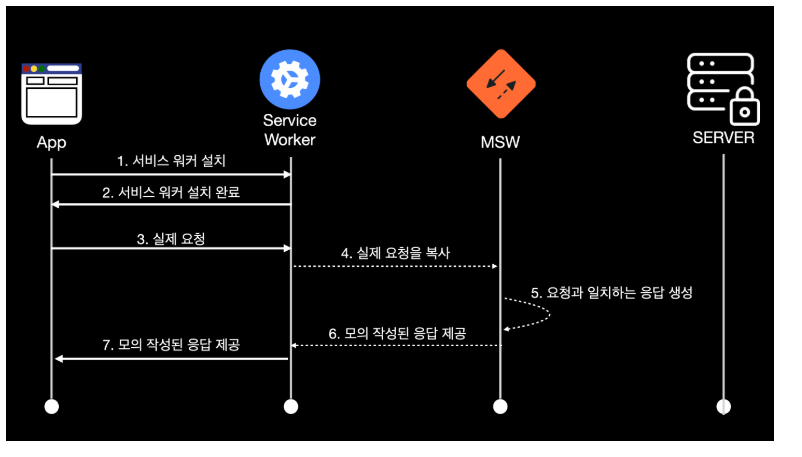

# API mocking의 중요성

- API mocking은 백엔드가 아직 준비되지 않았을때, 통합 테스트를 수행할 때 매우 중요한 역할을 한다. 실제 백엔드 서비스 없이도 프론트 어플리케이션의 동작을 시뮬레이션 할 수 있다.
  이는 개발 속도를 높이고, 백엔드와의 통합 부분에서 생길 수 있는 문제를 사전에 발견하고 해결할 수 있도록 도움을 준다.

# MSW(Mock Service Worker) 소개

- msw는 브라우저와 node.js 환경에서 네트워크 요청을 가로채고 모킹할 수 있는 라이브러리. Service Worker API를 사용하여 실제 네트워크 요청을 가로채고, 개발자가 정의한 응답으로 대체한다. 즉, 실제 백엔드 서버 없이도 API요청과 응답을 시뮬레이션을 할 수 있다.

- Service Worker는 브라우저의 main thread(ui thread)와 분리된 background thread에서 실행이 된다. background thread는 main thread(ui thread)와 별개로 작동하는 thread로 시간이 오래 걸리는 작업(ex: 네트워크 요청, 대용량 파일 읽기)을 하게 된다. background thread에서 처리된 결과는 ui thread로 전달되어 사용자 인터페이스에 반영이 된다.

# MSW 동작 원리

- 브라우저에 service worker를 설치한다.
- 설치 후에는 브라우저에서 실제 이루어지는 요청을 service worker가 가로챈다.
- service worker에서는 실제 요청을 복사해서 msw에게 해당 요청과 일치하는 모의 응답을 제공받고 이를 브라우저에게 그대로 전달한다.

# MSW로 개발해보기

### step1. msw 기본 환경 설치하기

### step2. msw로 CRUD 만들어보기

### step3. Front에서 TODO만들어 api 연결해보기

출처:
https://medium.com/@iamkjw/msw%EB%A1%9C-api-%EB%AA%A8%ED%82%B9%ED%95%98%EA%B8%B0-29c80bbed37b
https://f-lab.kr/insight/using-msw-for-api-mocking-in-react
https://tech.kakao.com/posts/458
