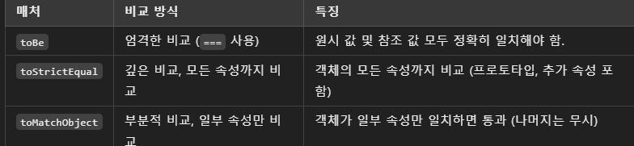

# jest 설치하기 (babel를 사용하여)

# jest matcher함수들

- toBe, toStrictEqual, toMatchObject

## tobe

두 값이 엄격히 동일한지(strict equality, === 사용) 비교.
기본적으로 원시 값(primitive value)들을 비교할 때 사용.
객체나 배열의 참조(메모리 주소)까지 정확히 일치해야 통과.
객체 비교시 같은 값이라도 다른 참조를 가진 객체는 같지 않다고 판단.

```js
expect(1).toBe(1); // pass
expect([1, 2, 3]).toBe([1, 2, 3]); // fail
expect({}).toBe({}); // fail
```

## toStrictEqual

완전한 비교를 원할 때 사용하며, 객체의 모든 속성과 값, 타입이 동일

```js
const obj1 = { a: 1, b: 2, c: 3 };
const obj2 = { a: 1, b: 2, c: 3 };
const obj3 = { a: 1 };

expect(obj1).toStrictEqual(obj2); // pass
expect(obj1).toStrictEqual(obj3); // fail
```

## toMatchObject

객체의 일부 속성만 비교할 때 유용하며, 전체 객체의 정확한 일치 없이 일부 속성만 일치해도 통과

```js
const obj1 = { a: 1, b: 2, c: 3 };
const obj2 = { a: 1, b: 2, c: 3 };
const obj3 = { a: 1 };

expect(obj1).toStrictEqual(obj2); // 통과
expect(obj1).toStrictEqual(obj3); // 통과
```

# 요약


